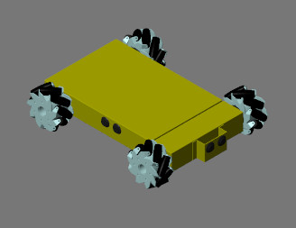

# Simscape_Robot_Mecanum

If you use it, especially  if it is used to the publish something about it, cite the following publication, thanks, it is open to use, it is the only condition, credits to the authors:
[Ricardo Pizá, Rafael Carbonell, Vicente Casanova, Ángel Cuenca and Julián J. Salt Llobregat - Nonuniform Dual-Rate Extended Kalman-Filter-Based Sensor Fusion for Path-Following Control of a Holonomic Mobile Robot with Four Mecanum Wheels - MDPI - Appl. Sci. 2022](https://doi.org/10.3390/app12073560) - [Video](https://youtu.be/Ygz6oj7O_UY)
